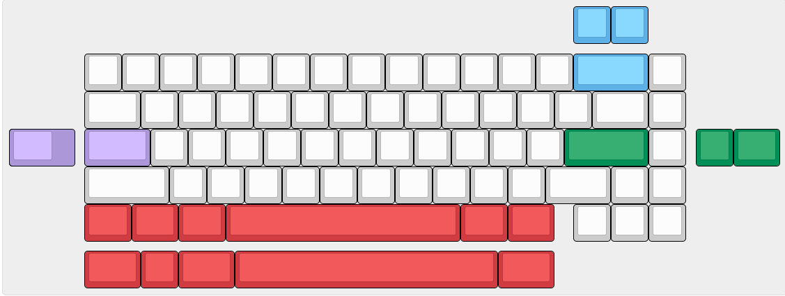

# Genesis
A 65% keyboard pcb with support for the [C3, C4, and S1 unified daughterboards](https://unified-daughterboard.github.io/).  
It also uses the [bakeneko65's](https://github.com/kkatano/bakeneko-65) outline, but don't expect it to be 100% compatible.  
This project was made back in 2022 using an older KiCad version, so some issues may come up when using a modern version.  

# layout
  
